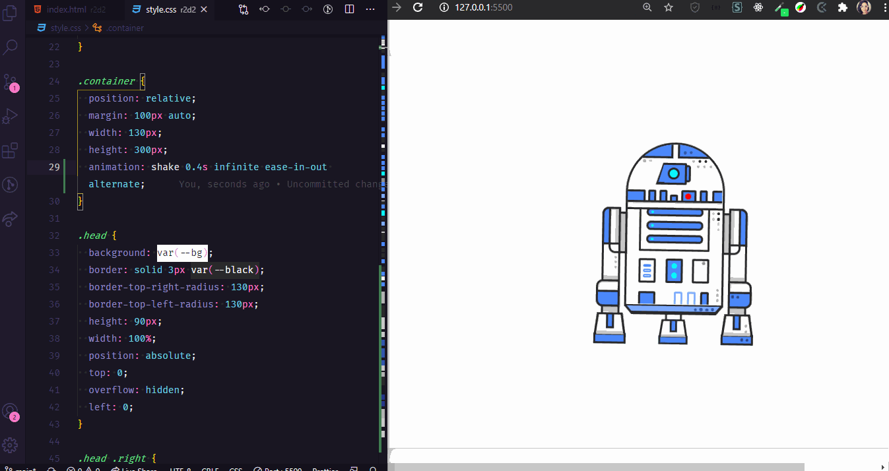

<h1 align="center">Ilustração R2-D2 em HTML e CSS Puro</h1>

  
  

<blockquote align="center">“A chave para transformação é a continuidade. Continue a codar!”</blockquote>

 

 
 

## Apresentação 
 

  

 

## Sobre o projeto
 

    Desenvolvimento de ilustração em CSS e HTML puro do R2-D2 para praticar.
    A ilustração foi feita com base em um projeto já pronto do DSGDSR. Abaixo segue o link para o projeto no CodePen.

https://codepen.io/DSGDSR/pen/aEYedo

 

## Tecnologias Utilizadas
 

- [x] HTML
- [x] CSS

 
 

 
 

<h3 align="center">
    
</h3>